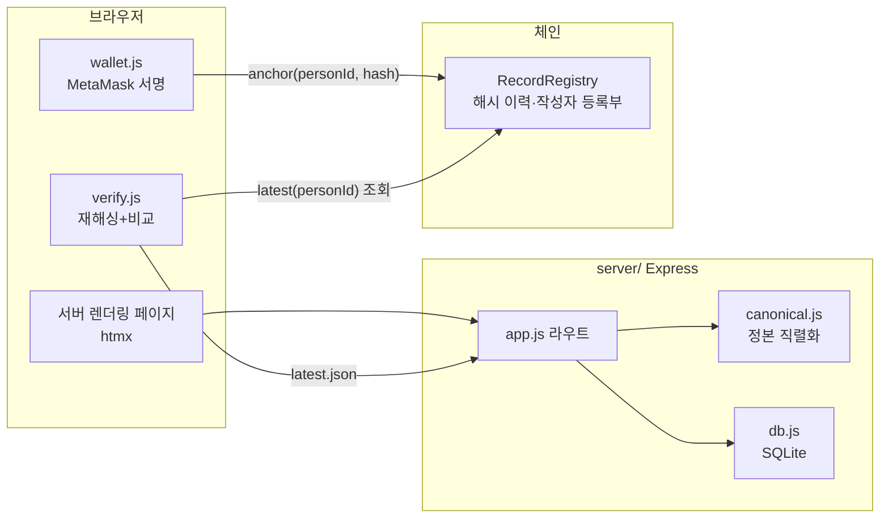
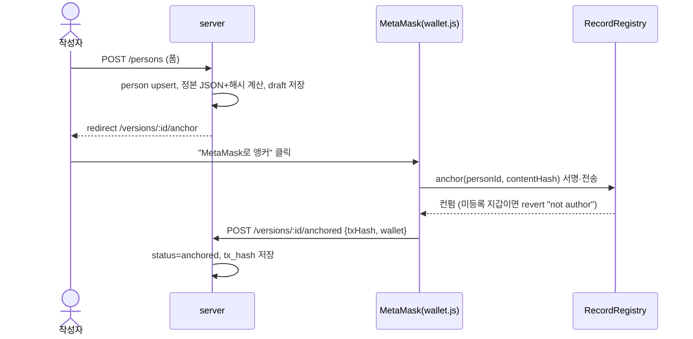
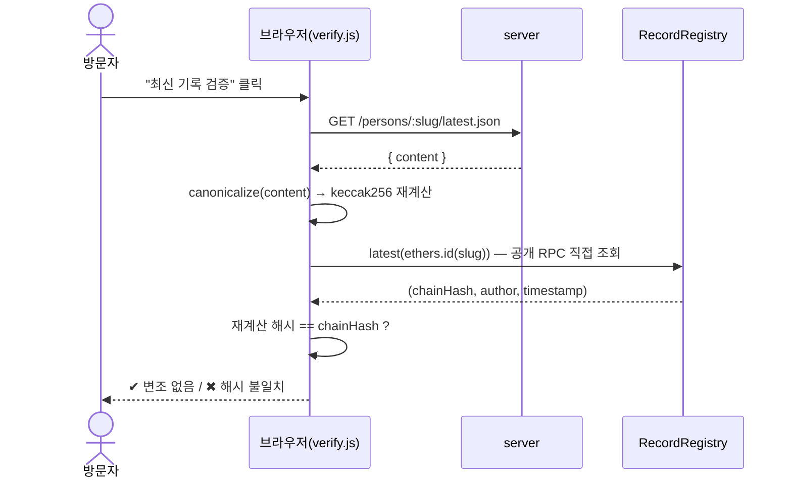

# 내부 아키텍처

기억 원장(memorial-ledger)의 내부 동작 문서. 설계 배경은
`docs/superpowers/specs/2026-08-01-record-registry-design.md`, 구현 이력은
`docs/superpowers/plans/2026-08-01-record-registry-v1.md` 참고.

## 전체 그림



핵심 원칙: **기록 원본은 오프체인, 기록의 지문(해시)은 온체인.** 서버는 편의를
제공할 뿐 신뢰의 근거가 아니다. 신뢰가 필요한 두 동작(서명, 검증)만 브라우저
JS 섬으로 분리되어 있다.

## 정본 직렬화 (canonical.js)

해시가 재현 가능하려면 "같은 내용 → 항상 같은 바이트열"이 보장돼야 한다.
`server/public/canonical.js`의 규칙:

1. 객체 키를 **재귀적으로 사전순 정렬** (배열 순서는 보존)
2. 모든 문자열(값과 키 모두)을 **유니코드 NFC로 정규화** — 한글은 조합형(NFD)과
   완성형(NFC) 바이트가 다르므로 정규화 없이는 같은 "김구"가 다른 해시를 낸다
3. 공백 없는 `JSON.stringify`

해시는 `keccak256(utf8bytes(canonicalize(content)))`. 이 파일 하나를 서버(ESM
import)와 브라우저(`<script type="module">`)가 **공유**하므로 두 환경의 구현이
어긋날 수 없다.

정본 content 스키마 (draft 생성 시점의 DB 스냅샷):

```json
{ "slug": "...", "name": "...", "category": "...",
  "birth": "...", "death": "...", "summary": "...",
  "sources": [{ "label": "...", "url": "..." }] }
```

## 컨트랙트 (RecordRegistry.sol)

상태:

| 저장소 | 타입 | 의미 |
|---|---|---|
| `owner` | `address` | 배포자. 작성자 등록 권한 |
| `authorProfiles` | `mapping(address => string)` | 지갑 → 공개 프로필 URI. **비어있지 않으면 작성 권한 있음** (allowlist) |
| `history` | `mapping(bytes32 => Version[])` | personId → 버전 이력. **push만 존재, 삭제·수정 함수 없음** |

`Version = { contentHash: bytes32, author: address, timestamp: uint64 }`

함수:

- `registerAuthor(addr, profileUri)` — owner 전용. 빈 URI 거부. 익명성 배제는
  여기서 구현된다: 작성 권한은 반드시 공개 프로필과 함께 부여된다.
- `anchor(personId, contentHash)` — 등록 작성자 전용(`onlyAuthor`). 이력 배열에
  추가하고 `RecordAnchored(personId, contentHash, author, versionIndex)` 발행.
- `versionCount / getVersion / latest` — 조회 뷰. `latest`는 이력이 비어 있으면
  `"no versions"`로 revert.

`personId = keccak256(utf8(slug))` — 서버·브라우저·테스트 모두 `ethers.id(slug)`
한 가지 방법으로 계산한다.

## 데이터 모델 (SQLite, db.js)

```
persons(slug PK, name, category, birth, death, summary)
sources(id, person_slug FK, label, url)
authors(id, name, credential, wallet UNIQUE)
record_versions(id, person_slug FK, content_json, content_hash,
                status 'draft'|'anchored', tx_hash, wallet, created_at)
```

- `record_versions.content_json`은 **정본 직렬화된 문자열 그대로** 저장한다.
  나중에 재직렬화하지 않으므로 직렬화 규칙이 진화해도 과거 버전 해시가 깨지지 않는다.
- 상태는 `draft → anchored` 2단계. 트랜잭션 실패 시 draft로 남고, 앵커 페이지
  재방문으로 재시도한다.
- 모든 쿼리는 `?` 바인딩(preparedStatement)만 사용 — 문자열 조립 SQL 없음.

## 기록 등록 흐름



서버는 draft 생성에 로그인장치를 두지 않는다 — 진짜 게이트는 온체인 allowlist다
(미등록 지갑은 anchor가 revert). 서버가 저장하는 `txHash`도 신뢰 근거가 아니라
편의 정보다. 진실은 항상 검증 절차가 확인한다.

## 편집 거버넌스 (수정 요청 → 심사 → 확정)

기록의 내용이 사실인지는 체인이 못 막는 영역이다. 그 빈틈을 절차로 메운다 —
논문 피어 리뷰와 같은 구조다.

```
제보(open) ──작성자 판단──┬─ 단순 정정: 기존처럼 단독 수용/반려
                          └─ 실질 변경: POST /requests/:id/escalate → in_review
in_review ── 검토자들이 실명 공개 리뷰(approve|reject|needs_work) ── 정족수 충족 시에만 수용
accepted ── 작성자가 새 버전으로 종합·앵커 (note에 요청 ID)
```

```
change_requests(id, person_slug FK, requester_name, requester_contact, field,
                proposed, evidence, status 'open'|'in_review'|'accepted'|'rejected',
                resolver_name, resolution_note, resolved_version_id FK, created_at, resolved_at)
reviews(id, request_id FK, reviewer_name, verdict 'approve'|'reject'|'needs_work',
        comment, created_at)
```

- **정족수**(`reviewStatus`): 검토자별 **최신** 평결 기준 `approve >= 2` AND
  `reject == 0`. 최신 것만 세므로 검토자가 새 리뷰로 자기 평결을 갱신할 수 있다
  — 반대가 보완으로 해소되는 경로다.
- **자기 심사 방지**: 요청의 제안자와 이름이 같은 검토자는 정족수 계산에서 제외된다.
  서버 로그인이 없으므로 실명 일치 기준이고, v1 원칙 그대로 공개 기록이 책임 장치다.
- **강제는 서버에서**: `POST /requests/:id/resolve`는 in_review에서 accepted로 갈 때
  정족수 미충족이면 **403**. 수용 버튼을 숨기는 UI는 편의일 뿐 게이트가 아니다.
  심사 전환은 open에서만(아니면 409), 리뷰 제출은 in_review에서만(아니면 409).
- **단순 정정 예외**: open에서의 단독 수용/반려 경로는 그대로 남는다. 오탈자까지
  심사에 넣으면 절차가 마비된다.
- 리뷰는 **오프체인 공개 기록**이다. 체인에 오르는 것은 여전히 확정된 기록의 해시뿐.

## 검증 흐름 (verify.js) — 이 프로젝트의 존재 이유



주의할 불변식:

- verify.js는 서버가 준 `contentHash` 필드를 **비교에 사용하지 않는다.**
  반드시 `content`에서 재계산한다 (서버가 해시만 맞춰 보낼 가능성 차단).
- RPC 주소는 페이지 data 속성으로 주입되지만, 궁극적으로 사용자는 자신이
  신뢰하는 RPC로 바꿔 검증할 수 있다 (컨트랙트 주소·slug만 알면 독립 검증 가능).

## 신뢰 모델 요약

| 위협 | 방어 |
|---|---|
| 서버가 기록을 몰래 수정 | 브라우저 재해싱 vs 온체인 해시 불일치로 드러남 |
| 서버가 해시만 위조해 전달 | verify.js는 content에서 재계산 (서버 해시 무시) |
| 익명·미검증 작성자의 기록 | 온체인 allowlist — 미등록 지갑 anchor revert |
| 기록 이력 은폐·삭제 | history는 push 전용, 체인상 영구 공개 |
| 내용 자체가 거짓 | **체인이 못 막는 영역** — 출처 명시 + 실명 작성자 책임으로 담보 |

## 테스트 지도

| 파일 | 검증 대상 |
|---|---|
| `contracts/test/RecordRegistry.test.js` | allowlist 강제, push 전용 이력, 이벤트, latest revert (8) |
| `server/test/canonical.test.js` | 키 정렬, NFC 재현성, 배열 순서 보존 (5) |
| `server/test/db.test.js` | upsert, 검색·필터, draft→anchored 전이 (4) |
| `server/test/app.test.js` | 라우트, htmx 부분렌더, 해시 일치, 입력 검증, 404 (10) |
| `server/test/e2e.test.js` | 실제 hardhat node로 등록→앵커→검증 풀루프 (1) |
